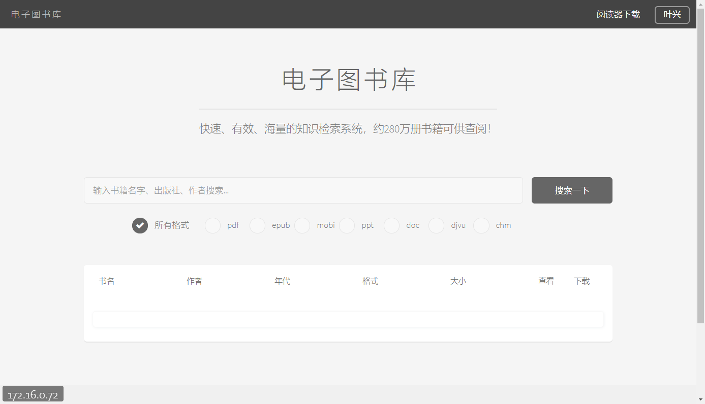
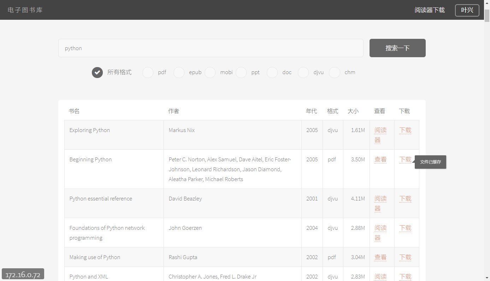
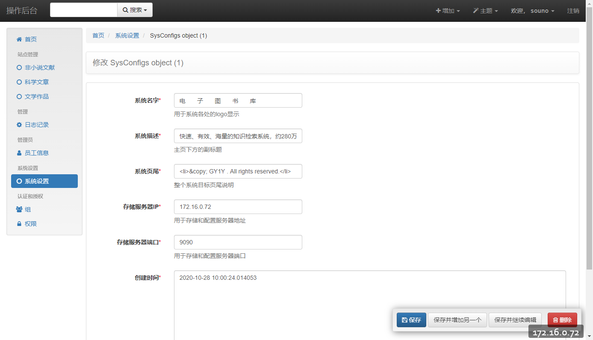

# libgen-django
libgen-django,使用Django框架实现的Libgen web服务端。

### 截图

### requirements

asgiref==3.2.7
coverage==5.1
defusedxml==0.6.0
diff-match-patch==20181111
django-cors-headers==3.2.1
django-crispy-forms==1.9.0
django-filter==2.2.0
django-filters==0.2.1
django-formtools==2.2
django-import-export==2.0.2
django-reversion==3.0.7
django==3.0.5
djangorestframework-jwt==1.11.0
drfdocs==0.0.11
et-xmlfile==1.0.1
future==0.18.2
httplib2==0.17.2
jdcal==1.4.1
markuppy==1.14
odfpy==1.4.1
openpyxl==3.0.3
pyjwt==1.7.1
pytz==2019.3
pyyaml==5.3.1
sqlparse==0.3.1
tablib[html,ods,xls,xlsx,yaml]==1.1.0
xlrd==1.2.0
xlsxwriter==1.2.8
xlwt==1.3.0
pymysql

### 数据库dump

[http://libgen.rs/dbdumps/](http://libgen.rs/dbdumps/)

在此处下载数据库dump，导入开发数据库中。

### 联系方式

souno@qq.com